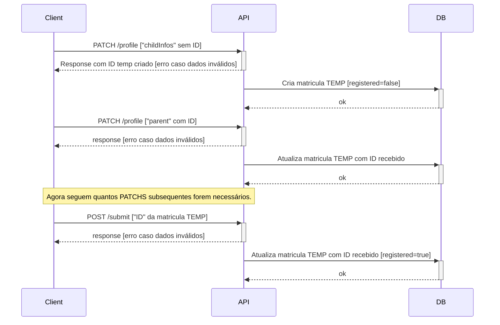
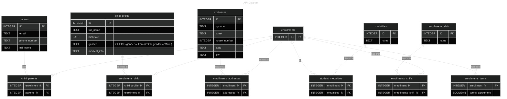

# Profile APP

Minimal API doing CRUD with partial updates to profile system.

### TODO
- [ ] Submit feature. When the profile is fulled with all information needed, 
we submit the profile to check data and save as registered profile.
- [ ] Handle multiple relations at once, create guards to MAX relations number. For now, just order and pick latest one.

### API regular flow diagram

### Database Modeling

### Refs:
- https://medium.com/@gabrieletronchin/asp-net-core-filter-samples-implementations-ecb2beb71b02
- https://github.com/dotnet/runtime/issues/23510
- https://stackoverflow.com/questions/2884863/under-what-circumstances-is-an-sqlconnection-automatically-enlisted-in-an-ambient

